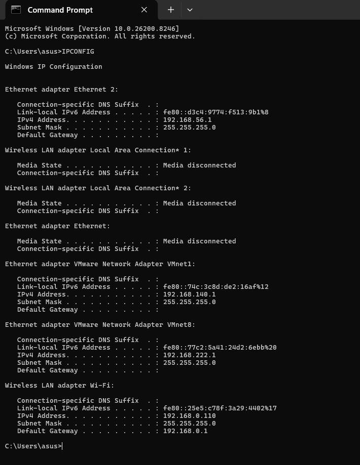

# MODUL 10 IP
IP Address (Internet Protocol Address) adalah alamat unik yang digunakan untuk mengenali perangkat dalam suatu jaringan, baik jaringan internet maupun lokal. IP address berfungsi seperti alamat rumah agar data dapat dikirim ke perangkat yang benar.

Jenis-jenis

IPv4 : menggunakan 32-bit (contoh: 192.168.0.110)
IPv6 : menggunakan 128-bit (contooh: fe80::25e5:c78f:3a29:4402%17)

Cara menghitung

IPv4 terdiri dari 4 oktet yang masing-masing memiliki 8 bit, contoh IP 192.168.0.110

192 = 11000000
168 = 10101000
0 = 00000000
110 = 01101110

Subnet Mask pada jaringan tersebut adalah 255.255.255.0 yang digunakan untuk membagi Network ID dan Host ID.

Network ID : 192.168.0.0
Host ID : 110

Default Gateway yang digunakan adalah 192.168.0.1 sebagai penghubung perangkat ke jaringan lain atau internet.

## Langah-Langkah Percobaan
1. Buka CMD
2. Gunakan IPCONFIG untuk melihat IP dari device yang di gunakan

Perangkat menggunakan alamat IPv4 192.168.0.110 yang termasuk dalam jaringan private kelas C. Subnet mask 255.255.255.0 (/24) digunakan untuk memisahkan bagian network dan host pada jaringan. Dari konfigurasi tersebut, network address yang dimiliki adalah 192.168.0.0 dengan kapasitas hingga 254 host yang dapat terhubung dalam satu jaringan. Gateway utama yang digunakan yaitu 192.168.0.1 sebagai jalur akses menuju jaringan lain maupun internet. Selain IPv4, perangkat juga memiliki alamat IPv6 bertipe link-local untuk komunikasi dalam jaringan lokal.

# TRACEROUTE
Traceroute adalah perintah atau metode untuk melacak jalur perjalanan data dari perangkat kita menuju tujuan di jaringan atau internet.

Fungsinya dalam jaringan komputer:

- Mengetahui jalur koneksi data
- Mengecek apakah jaringan mengalami gangguan
- Mengetahui lokasi keterlambatan koneksi
- Membantu troubleshooting jaringan

## Langkah-Langkah Percobaan
1. Buka CMD
2. Ketik tracert google.com pada CMD
.png)
Hasil traceroute menunjukkan bahwa paket data melewati sekitar 23 router sebelum berhasil mencapai server Google. Hop pertama merupakan router lokal atau default gateway Wi-Fi yang digunakan perangkat, yaitu sebagai penghubung awal menuju internet. Hop berikutnya, sekitar hop 2 hingga 3, masih berada pada jaringan internal milik ISP. Setelah itu, pada hop 4 sampai 7, paket mulai memasuki jaringan publik internet.

Ketika mencapai hop 8 hingga 13, jalur koneksi sudah masuk ke jaringan milik Google. Beberapa hop pada bagian tengah perjalanan mengalami Request Timed Out (RTO) karena router tertentu tidak memberikan respons terhadap permintaan traceroute, namun hal tersebut tidak selalu menandakan adanya gangguan jaringan. Pada hop terakhir, paket berhasil mencapai server Google dengan alamat IP 142.251.12.113.

Waktu respons yang diperoleh berkisar antara 1 ms hingga 30 ms sehingga koneksi jaringan dapat dikatakan cukup stabil dan memiliki performa yang baik.

# IMCP, MTU, TTL
ICMP (Internet Control Message Protocol)
ICMP adalah protokol jaringan yang digunakan untuk mengirim pesan kontrol atau informasi kesalahan antar perangkat di jaringan. ICMP membantu proses pengecekan koneksi dan troubleshooting jaringan. Contoh penggunaannya terdapat pada perintah ping dan traceroute.

Fungsi ICMP:

Mengecek apakah host dapat dihubungi
Memberikan informasi error pada jaringan
Membantu diagnosa koneksi jaringan

MTU (Maximum Transmission Unit)
MTU merupakan ukuran maksimum data yang dapat dikirim dalam satu paket melalui jaringan. Jika ukuran paket melebihi batas MTU, maka paket akan dipecah menjadi beberapa bagian (fragmentasi).

Contoh umum:

Ethernet biasanya memiliki MTU 1500 byte

Fungsi MTU:

Mengatur efisiensi pengiriman data
Mengurangi fragmentasi paket
Membantu meningkatkan performa jaringan

TTL (Time To Live)
TTL adalah batas jumlah hop atau router yang dapat dilewati sebuah paket data di jaringan. Nilai TTL akan berkurang satu setiap kali paket melewati router. Jika nilainya mencapai 0, paket akan dibuang untuk mencegah paket berputar terus di jaringan.

Fungsi TTL:

Mencegah looping paket data
Membantu proses traceroute
Mengontrol umur paket dalam jaringan

Contoh:
Jika TTL awal bernilai 64 dan paket melewati 5 router, maka sisa TTL menjadi 59.

# FRAGMENTASI
Fragmentasi adalah proses pemecahan paket data menjadi beberapa bagian yang lebih kecil ketika ukuran paket melebihi batas MTU (Maximum Transmission Unit) pada jaringan yang dilewati. Setelah sampai ke tujuan, potongan-potongan paket tersebut akan disusun kembali menjadi data utuh.

## Langkah-Langkah Percobaan
1. Jalankan Wireshark pilih interface Wifi yang aktif
2. Klik Start
3. Buka CMD
4. Ketik ping google.com -l 2000 
5. Kembali ke Wireshark, gunakan filter ip.flags.mf == 1 || ip.frag_offset > 0
.png)

- Berdasarkan hasil capture Wireshark pada jaringan, terlihat beberapa paket ICMP mengalami proses fragmentasi. Hal ini ditunjukkan oleh informasi Fragmented IP protocol (proto=ICMP 1) pada paket IPv4 yang dikirim dari alamat IP 192.168.0.110 menuju 172.253.118.100.

- Ukuran paket yang tercatat sebesar 1514 bytes, sehingga melebihi batas MTU standar Ethernet sekitar 1500 bytes dan menyebabkan paket harus dipecah menjadi beberapa fragment. Pada detail paket juga terdapat nilai ID=420d yang menunjukkan bahwa fragment-fragment tersebut berasal dari satu paket data yang sama.

- Nilai off=0 menandakan fragment pertama dari paket yang dikirim. Selain itu, ditemukan keterangan Reassembled in #311 yang menunjukkan bahwa seluruh fragment berhasil digabung kembali menjadi paket ICMP utuh oleh perangkat tujuan. Paket ICMP tersebut berupa Echo (ping) request dengan nilai TTL sebesar 128.

Dari hasil analisis tersebut dapat disimpulkan bahwa paket ping yang dikirim mengalami fragmentasi karena ukuran data melebihi kapasitas MTU jaringan yang digunakan.

# IPV6
IPv6 (Internet Protocol version 6) merupakan generasi terbaru dari protokol IP yang dikembangkan sebagai pengganti IPv4. IPv6 memiliki alamat berukuran 128-bit dan penulisannya menggunakan format heksadesimal.

## Langkah-Langkah Percobaan
1. Membuka file ipv6_sample dengan wireshark
.png)

2. Menggunakan filter IPV6
.png)

Berdasarkan hasil capture di Wireshark, terlihat adanya paket yang menggunakan protokol IPv6. Hal ini bisa dilihat dari detail paket yang menampilkan Internet Protocol Version 6. Alamat source dan destination yang digunakan juga memakai format heksadesimal dengan tanda titik dua (:) yang menjadi ciri khas IPv6.
Pada bagian Next Header, paket diketahui menggunakan protokol TCP untuk proses komunikasi data. Paket tersebut dikirim ke port 443 yang biasanya digunakan untuk layanan HTTPS atau akses website secara aman. Selain itu, terdapat juga keterangan TCP Retransmission yang menandakan adanya pengiriman ulang paket karena paket sebelumnya belum diterima dengan sempurna.
Dari hasil pengamatan tersebut, dapat diketahui bahwa jaringan sudah menggunakan IPv6 dan komunikasi yang terjadi dipakai untuk mengakses layanan web melalui koneksi HTTPS.