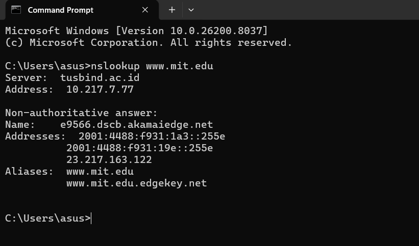
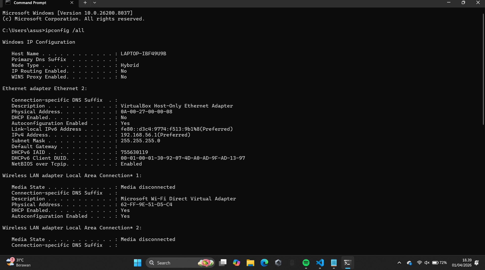

# MODUL 4 (DNS)
Domain Name System (DNS) memiliki peran penting dalam infrastruktur internet, ia mentranslasikan nama host ke bentuk alamat IP. Pada modul ini, kita akan mempelajari lebih lanjut sisi klien DNS. Perlu diingat bahwa peran klien dalam DNS relatif sederhana - klien hanya mengirimkan permintaan ke server DNS lokal dan menerima respons balik

## Modul 4.2 Nslookup
nslookup adalah sebuah perintah atau tool yang digunakan untuk mencari dan menampilkan informasi terkait Domain Name System (DNS), seperti mengetahui alamat IP dari sebuah domain atau sebaliknya, sehingga membantu pengguna dalam melakukan pengecekan jaringan dan troubleshooting koneksi.

## Langkah - Langkah percobaan
1. Buka cmd pada device yang di gunakan lalu ketik "nslookup www.mit.edu" lalu ENTER. Berfungsi untuk melihat IP 

2. Buka cmd lalu ketik "nslookup -type=NS mit.edu" lalu ENTER. Fungsinya untuk melihat server yang terhubung di "nslookup -type=NS mit.edu"
.png)

3. Buka cmd lalu ketik "nslookup www.aiit.or.kr bitsy.mit.edu" lalu ENTER. Fungsinya menanyakan ke server DNS bitsy.mit.edu tentang IP address dari domain "www.aiit.or.kr."
.png)

## Pertanyaan
1. Mencari IP server web di Asia
- Perintah : nslookup www.u-tokyo.ac.jp
- Domain : www.u-tokyo.ac.jp
- Alamat IP : 210.152.243.234

2. Mencari DNS otoritatif universitas di Eropa
- Perintah : nslookup -type=NS cam.ac.uk

3. Mencari mail server Yahoo melalui DNS tertentu
- Perintah : nslookup -type=MX gmail.com dns0.cam.ac.uk

# Modul 4.3 Ipconfig
ipconfig adalah perintah pada sistem operasi Windows yang digunakan untuk menampilkan dan mengelola konfigurasi jaringan pada komputer, seperti alamat IP, subnet mask, dan default gateway, sehingga membantu pengguna mengetahui kondisi dan pengaturan koneksi jaringan yang sedang digunakan.
## Langkah - Langkah Percobaan
1. Buka cmd lalu ketik "ipconfig /all" lalu ENTER. fungsi di sini untuk menampilkan ip dan dns pada laptop

2. Buka cmd lalu ketik "ipconfig /all > networkinfo.txt" lalu ENTER. Fungsi sama seperti sebelumnya cuman command tadi di gunakan untuk menyimpan ip dan dns yang sudah di tampilkan. untuk membuka atau melihat hasil (di laptop saya) yaitu buka file explorer lalu masuk ke folder C, setelah itu cari folder User, lalu masuk ke folder asus dan scroll ke bagian bawah.
.png)

.png)

3. Buka cmd lalu ketik "ipconfig /displaydns" lalu ENTER. Fungsinya untuk menampilkan dns
.png)

4. Buka cmd lalu ketik "ipconfig /flushdns" lalu ENTER. Fungsinya untuk menghapus dns yang sudah di buka dalam device yang di gunakan 
.png)

# 4.4 Tracing DNS dengan Wireshark
Mempelajari proses memantau dan menganalisis paket data DNS yang dikirim dan diterima oleh komputer melalui jaringan, sehingga pengguna dapat melihat bagaimana permintaan pencarian domain (DNS query) dikirim ke server dan bagaimana responsnya diterima, yang berguna untuk memahami alur kerja DNS serta membantu dalam proses troubleshooting jaringan.

# A. Analisis DNS Request dan Response pada Akses Website (www.ietf.org)

## Langkah - Langkah Percobaan
1. Buka cmd lalu ketik "IPCONFIG" untuk melihat IP lalu copy IP pada laptop masing-masing (10.218.11.201). lalu buka wireshark

2. Setelah buka wireshark pilih jaringan yang digunakan (saya menggunakan wifi). Setelah memilih wifi click bagian filter lalu ketik ip.addr == 10.218.11.201 (sesuai hasil di cmd)
.png)

3. Buka browser http://www.ietf.org/ 
.png)

4. Tambahkan filter lagi ip.addr == 10.218.11.201 && dns.qry.name contains "ietf"
.png)

## Pertanyaan
1. Apakah DNS menggunakan UDP atau TCP?

Dari percobaan yang di lakukan terilhat bahwa DNS menggunakan UDP

2. Port tujuan pada DNS request & port sumber pada DNS response

- DNS request = Source Port (client): 60621 & Destination Port (server): 53

- DNS RESPONSE = Source Port (server): 53 & Destination Port (client): 60621

# B. Analisis DNS Menggunakan Perintah nslookup (www.mit.edu)

## Langkah - Langkah percobaan
1. Buka CMD ketikan perintah nslookup www.mit.edu

2. Buka wireshark lalu pilih jaringan yang digunakan, setelah itu pada bagian filter ketik DNS 
.png)

## Pertanyaan
 1. Port tujuan request dan port sumber dari response

- DNS request = destination: 53

- DNS response = Source: 53

2. Alamat IP request

Pada perjobaan tersebut terlihat bahwa request DNS dikirim ke alamat IP 10.217.7.77

3. Type dan answer request

Pada percobaan yang di lakukan terlihat bawa type yang muncul adalah AAAA (IPv6 Address record) -> mencari alamat IPv6. Pesan ini tidak mengandung jawaban karena masih berupa permintaan (query) untuk mencari alamat IPv6 dari domain www.mit.edu

# C. Analisis DNS Record NS Menggunakan nslookup (mit.edu)

## Langkah - Langkah Percobaan
1. Buka CMD ketikan perintah nslookup -type=NS mit.edu

2. Buka Wireshark lalu pilih wifi, setelah itu pada bagian filter ketik dns untuk memunculkan bagian dns saja
.png)

3. Ambil data dari Standard query (request) dan Standard query response dari NS mit.edu
.png)

## Pertanyaan 
1. Alamat IP request

2. Type dan answers request

Pada percobaan bisa terlihat bahwa Type request dari DNS adalah NS yang artinya tidak mengandung jawaban karena hanya permintaan

3. Answer Response

# D. Analisis DNS Menggunakan Server Tertentu (www.aiit.or.kr bitsy.mit.edu)

## Langkah - Langkah Percobaan
1. Buka CMD ketikan nslookup www.aiit.or.kr bitsy.mit.edu

2. Buka Wireshark lalu pilih wifi, setelah itu pada bagian filter ketik dns untuk memunculkan bagian dns saja
.png)

3. Ambil data dari Standard query (request) dari www.aiit.or.kr
.png)

## Pertanyaan
1. Alamat IP request

Pesan permintaan DNS dikirim ke alamat IP 18.0.72.3. Alamat tersebut merupakan server bitsy.mit.edu yang ditentukan secara manual pada perintah nslookup, sehingga bukan merupakan DNS server lokal

2. Type dan answers request

Tipe DNS request adalah A (Address Record). Pesan ini tidak mengandung jawaban karena hanya berupa permintaan

3. Answers response Berdasarkan hasil pada Command Prompt, terlihat bahwa terjadi “DNS request timed out”, yang menunjukkan bahwa server DNS tidak merespon permintaan yang dikirimkan

