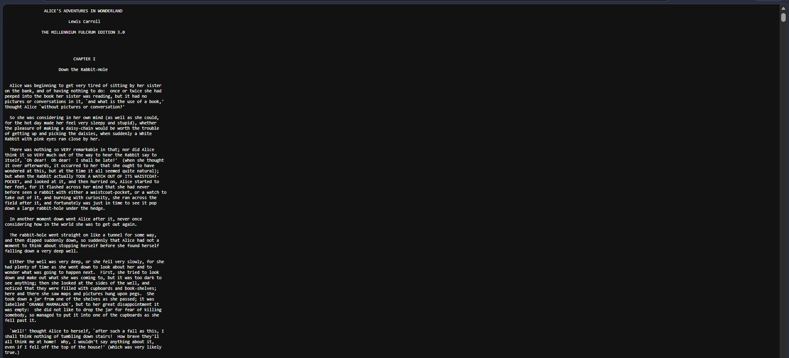

# MODUL 6 TCP 

## 6.2 Menangkap Tansfer TCP dalam Jumlah Besar dari Komputer Pribadi ke remote server
## Langkah - Langkah percobaan
1. buka browser yang di gunakan lalu buka web http://gaia.cs.umass.edu/wireshark-labs/alice.txt, setelah itu save file yang tertera

2. Selanjutnya buka http://gaia.cs.umass.edu/wireshark-labs/TCP-wireshark-file1.html.
.png)

3. Langkah selanjutnya setalah buka link tersebut yaitu upload file yang sudah di save pada langkah pertama lalu upload dan tampilan akan muncul seperti pada gambar
.png)