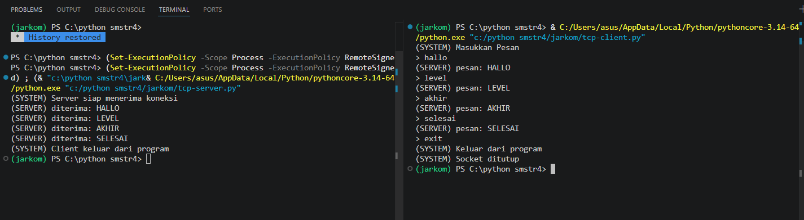

# MODUL 7 : SOCKET PROGRAMMING
- Socket Programming merupakan metode dalam pemrograman yang digunakan untuk memungkinkan komunikasi antar perangkat melalui jaringan, baik itu dalam jaringan lokal (LAN) maupun internet. Dengan socket, data dapat dikirim dan diterima menggunakan protokol jaringan seperti TCP dan UDP.

- TCP (Transmission Control Protocol) bersifat connection-oriented, sehingga memastikan data dikirim secara andal dan sampai ke tujuan. Sementara itu, UDP (User Datagram Protocol) lebih cepat karena tidak memerlukan koneksi khusus, namun tidak menjamin keutuhan atau keberhasilan pengiriman data.

- Dalam konsep dasar socket terdapat dua peran utama, yaitu server dan client. Server bertugas untuk menunggu permintaan koneksi dari client serta menerima dan mengolah data yang masuk. Sedangkan client berfungsi untuk menginisiasi koneksi ke server, kemudian mengirim dan menerima data selama proses komunikasi berlangsung.

# TCP
## TCP Client
#SOCKET = Perkalian pembagian pengurangan penjumlahan
from socket import *

serverName = 'localhost'
serverPort = 12000 

clientSocket = socket(AF_INET, SOCK_STREAM) # AF_INET = IPv4, SOCK_STREAM = TCP

clientSocket.connect((serverName, serverPort))

print("(SYSTEM) Masukkan Pesan")

running = True
while running:
    #input
    message = input('> ')

    #mengirim ke server
    #encodde = mengubah string menjadi bytes
    clientSocket.send(message.encode())

    # kalo exit = socket ditutup
    if message.lower() == 'exit':
        print("(SYSTEM) Keluar dari program")
        running = False
        break

    #menerima pesan dari server
    modifiedMessage = clientSocket.recv(2048)

    #decode = mengubah bytes menjadi string
    print("(SERVER) pesan: " + modifiedMessage.decode())

#tutup socket
clientSocket.close()
print("(SYSTEM) Socket ditutup")

## TCP Server 
from socket import *

serverPort = 12000
serverSocket = socket(AF_INET, SOCK_STREAM) # AF_INET = IPv4, SOCK_STREAM = TCP

#mengbind server 
serverSocket.bind(('', serverPort))

#server siap menerima koneksi
serverSocket.listen(1)
print("(SYSTEM) Server siap menerima koneksi")

running = True
while running:
    connectionSocket, addr = serverSocket.accept() # menerima koneksi dari client

    while True:
        message = connectionSocket.recv(2048).decode() # menerima pesan dari client

        if not message:
            break

        if message.lower() == 'exit':
            print("(SYSTEM) Client keluar dari program")
            running = False
            break

        #memodifikasi menjadi capslock
        ModifiedMessage = message.upper()
        print("(SERVER) diterima: " + ModifiedMessage)

        # kirim ke client
        connectionSocket.send(ModifiedMessage.encode())

    connectionSocket.close() # tutup koneksi dengan client
    serverSocket.close() # tutup socket server

1. Server dijalankan dulu melalui terminal
2. Server menunggu koneksi
3. Client dijalankan melalui terminal
4. Client connect ke server
5. Client kirim pesan
6. Server akan menerima pesan, mengubah ke huruf besar, mengirim balik
7. Client menampilkan hasil
8. Jika kirim "exit" maka koneksi ditutup

# UDP
## UDP Client
from socket import *
import sys

#Konfigurasi alamat dan port server
serverName = '10.218.0.116'
serverPort = 12000

#Inisialisasi socket UDP di luar loop agar tidak dibuat berulang-ulang
clientSocket = socket(AF_INET, SOCK_DGRAM)
clientSocket.settimeout(5)  # Batas waktu tunggu 5 detik

print("Ketik 'exit' untuk mematikan server dan keluar, atau 'keluar' untuk tutup client saja.\n")

try:
    while True:
        # Input pesan dari pengguna
        message = input('Masukkan kalimat lowercase : ')
        
        # Validasi jika input kosong
        if not message:
            continue

        # Mengirim pesan ke server
        clientSocket.sendto(message.encode(), (serverName, serverPort))
        
        # Cek apakah pengguna ingin keluar
        if message.lower() == 'exit':
            print("Perintah exit dikirim. Mematikan server dan menutup klien...")
            break
        elif message.lower() == 'keluar':
            print("Menutup klien...")
            break
        
        try:
            # Menerima balasan dari server
            modifiedMessage, serverAddress = clientSocket.recvfrom(2048)
            print(f"Balasan dari Server: {modifiedMessage.decode()}\n")
        except timeout:
            print("Kesalahan : Server tidak merespons (Timeout).\n")

except Exception as e:
    print(f"Terjadi kesalahan : {e}")
finally:
    # Menutup koneksi socket secara permanen saat loop berhenti
    clientSocket.close()
    print("Koneksi ditutup.")

## UDP Server
from socket import *
import sys

#Konfigurasi server
serverPort = 12000
serverSocket = socket(AF_INET, SOCK_DGRAM)
serverSocket.bind(('', serverPort))

print(f"Server UDP siap menerima pesan pada port {serverPort}")
print("Ketik 'exit' dari sisi klien untuk mematikan server secara remote.\n")

try:
    while True:
        # Menerima pesan dari klien
        message, clientAddress = serverSocket.recvfrom(2048)
        
        # Mendekode pesan
        original_message = message.decode().strip()
        
        # Cek apakah pesan adalah perintah untuk keluar
        if original_message.lower() == 'exit':
            print(f"Mematikan server...")
            break
        
        # Mengubah pesan menjadi huruf kapital
        modifiedMessage = original_message.upper()
        
        # Menampilkan informasi klien dan isi pesan
        print(f"Diterima dari {clientAddress[0]}:{clientAddress[1]}: {original_message}")
        print(f"Mengirim balik : {modifiedMessage}")
        
        # Mengirim kembali pesan yang telah diubah ke klien
        serverSocket.sendto(modifiedMessage.encode(), clientAddress)
        
except Exception as e:
    print(f"\nTerjadi kesalahan : {e}")
finally:
    print("Server telah berhenti.")
    serverSocket.close()
    sys.exit(0)

.png)

- Server dijalankan
- Client mengirim pesan ke server
- Server akan menerima pesan, mengubah ke huruf besar, mengirim balik
- Client menerima balasan
- Jika "exit" maka server berhenti

# TCP dan UDP
## Perbedaan
Perbedaan TCP dan UDP

1. Cara Koneksi
TCP bekerja dengan membangun koneksi terlebih dahulu sebelum proses pengiriman data dimulai. Sebaliknya, UDP tidak memerlukan proses koneksi, sehingga data bisa langsung dikirim tanpa tahap awal.

2. Keandalan Pengiriman
Pada TCP, data dikirim dengan jaminan sampai ke tujuan secara utuh dan berurutan. Sementara itu, UDP tidak menjamin apakah data benar-benar sampai atau tidak, maupun urutannya.

3. Performa / Kecepatan
Karena adanya proses pengecekan dan kontrol, TCP cenderung lebih lambat. Di sisi lain, UDP lebih cepat karena tidak memiliki mekanisme kontrol yang kompleks.

4. Contoh Penggunaan
TCP biasanya digunakan pada layanan yang membutuhkan keakuratan tinggi seperti browsing web dan pengiriman email. Sedangkan UDP sering dipakai pada aplikasi yang mengutamakan kecepatan, seperti streaming video dan game online.